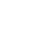
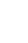
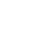
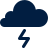

# OCHA Humanitarian Icons

> **Note:** For the latest versions and more file-type and/or color-options: <https://brand.unocha.org/>

## Source
These icons were created by [The United Nations Office for the Coordination of Humanitarian affairs (OCHA)](https://www.unocha.org).  
See: <https://www.unocha.org/story/iconography-part-un%E2%80%99s-humanitarian-efforts-ocha-releases-new-humanitarian-icons>

## Changes

The fill color is changed to adapt to use within applications created by [The Netherlands Red Cross](https://github.com/rodekruis).

## Preview

> Click on the images to open the exact URL.

| White Icon | Blue Icon | Name [↕️](# "Sort by Name") |  Category [↕️](# "Sort by Category") |
|:------:|:------:| ------ | ------ |
|  |  | Abduction / Kidnapping | Security and Incident |
|  |  | About | UX / UI |
|  |  | Add | UX / UI |
|  |  | Add Document | UX / UI |
|  |  | Advocacy | Activities / Strategy |
|  |  | Affected Population | People |
|  |  | Agile | Activities / Strategy |
|  |  | Agriculture | Other Sectors |
|  |  | Airport | Logistics |
|  |  | Airport Affected | Damage |
|  |  | Airport Closed | Lockdown |
|  |  | Airport Destroyed | Damage |
|  |  | Airport Military | Logistics |
|  |  | Airport Not Affected | Damage |
|  |  | Alert | UX / UI |
|  |  | Analysis | Activities / Strategy |
|  |  | Arrest / Detention | Security and Incident |
|  |  | Assault | Security and Incident |
|  |  | Assembly Point | General Infrastructure |
|  |  | Assessment | Activities / Strategy |
|  |  | Attack | Security and Incident |
|  |  | Bacteria | Health |
|  |  | Blanket | Food and Non-Food Items |
|  |  | Blog | UX / UI |
|  |  | Boat | Logistics |
|  |  | Bookmark | UX / UI |
|  |  | Border Closed | Lockdown |
|  |  | Border Crossing | Physical Barriers |
|  |  | Borehole | Water, Sanitation and Health |
|  |  | Bottled Water | Food and Non-Food Items |
|  |  | Bridge | Logistics |
|  |  | Bridge Affected | Damage |
|  |  | Bridge Closed | Lockdown |
|  |  | Bridge Destroyed | Damage |
|  |  | Bridge Not Affected | Damage |
|  |  | Bucket | Food and Non-Food Items |
|  |  | Buddhist Temple | General Infrastructure |
|  |  | Building | General Infrastructure |
|  |  | Building Closed | Lockdown |
|  |  | Building Facility Affected | Damage |
|  |  | Building Facility Destroyed | Damage |
|  |  | Building Facility Not Affected | Damage |
|  |  | Bus | Logistics |
|  |  | Calendar | Product Type |
|  |  | Camp Coordination And Camp Management | Clusters |
|  |  | Car | Logistics |
|  |  | Carjacking | Security and Incident |
|  |  | Case Management | Health |
|  |  | Cash Transfer | Activities / Strategy |
|  |  | Cell Tower | Telecommunications and Technology |
|  |  | Chart | Product Type |
|  |  | Chat | UX / UI |
|  |  | Checkpoint | Physical Barriers |
|  |  | Child Care / Child Friendly | Other Sectors |
|  |  | Child Combatant | People |
|  |  | Child Protection | Other Sectors |
|  |  | Children | People |
|  |  | Church | General Infrastructure |
|  |  | Civil-Military Coordination | Activities / Strategy |
|  |  | Clinic | General Infrastructure |
|  |  | Clothing | Food and Non-Food Items |
|  |  | Cold Wave | Disaster / Hazards and Crises |
|  |  | Communal Latrine | Water, Sanitation and Health |
|  |  | Community Building | General Infrastructure |
|  |  | Community Engagement | Activities / Strategy |
|  |  | Computer | Telecommunications and Technology |
|  |  | Confined | Security and Incident |
|  |  | Conflict | Disaster / Hazards and Crises |
|  |  | Coordinated Assessment | Activities / Strategy |
|  |  | Coordination | Other Sectors |
|  |  | Copy | UX / UI |
|  |  | Country | General Infrastructure |
|  |  | Covid-19 | Health |
|  |  | Cyclone | Disaster / Hazards and Crises |
|  |  | Damaged / Affected | Damage |
|  |  | Dangerous Area | Security and Incident |
|  |  | Data | Product Type |
|  |  | Dead | People |
|  |  | Debris Management | Socioeconomic and Development |
|  |  | Deployment | Activities / Strategy |
|  |  | Destroyed | Damage |
|  |  | Detergent | Food and Non-Food Items |
|  |  | Diplomatic Mission | General Infrastructure |
|  |  | Distribution Site | General Infrastructure |
|  |  | Doctor | Health |
|  |  | Document | Product Type |
|  |  | Down | UX / UI |
|  |  | Download | UX / UI |
|  |  | Drought | Disaster / Hazards and Crises |
|  |  | Drowned | People |
|  |  | Early Recovery | Clusters |
|  |  | Earthmound | Physical Barriers |
|  |  | Earthquake | Disaster / Hazards and Crises |
|  |  | Education | Clusters |
|  |  | Elderly | People |
|  |  | Email | Telecommunications and Technology |
|  |  | Emergency Telecommunications | Clusters |
|  |  | Environment | Other Sectors |
|  |  | Epidemic | Disaster / Hazards and Crises |
|  |  | Exit / Cancel | UX / UI |
|  |  | Famine | Disaster / Hazards and Crises |
|  |  | Favourite | UX / UI |
|  |  | Fax | Telecommunications and Technology |
|  |  | Ferry | Logistics |
|  |  | Film | Product Type |
|  |  | Filter | UX / UI |
|  |  | Financing | Activities / Strategy |
|  |  | Fire | Disaster / Hazards and Crises |
|  |  | Fishery | Other Sectors |
|  |  | Flash Flood | Disaster / Hazards and Crises |
|  |  | Flood | Disaster / Hazards and Crises |
|  |  | Flour | Food and Non-Food Items |
|  |  | Folder | UX / UI |
|  |  | Food | Food and Non-Food Items |
|  |  | Food Security | Clusters |
|  |  | Food Warehouse | General Infrastructure |
|  |  | Forced Entry | Security and Incident |
|  |  | Forced Recruitment | Security and Incident |
|  |  | Fund | Activities / Strategy |
|  |  | Gap Analysis | Activities / Strategy |
|  |  | Gas Station | Logistics |
|  |  | Gender | People |
|  |  | Gender Based Violence | Security and Incident |
|  |  | Go | UX / UI |
|  |  | Government Office | General Infrastructure |
|  |  | Group | UX / UI |
|  |  | Handwashing | Health |
|  |  | Harassment / Intimidation | Security and Incident |
|  |  | Health | Clusters |
|  |  | Health Facility | General Infrastructure |
|  |  | Health Facility Affected | Damage |
|  |  | Health Facility Destroyed | Damage |
|  |  | Health Facility Not Affected | Damage |
|  |  | Health Post | General Infrastructure |
|  |  | Health Worker | Health |
|  |  | Heatwave | Disaster / Hazards and Crises |
|  |  | Heavy Rain | Disaster / Hazards and Crises |
|  |  | Helicopter | Logistics |
|  |  | Helipad | Logistics |
|  |  | Help | UX / UI |
|  |  | Hide | UX / UI |
|  |  | Hindu Temple | General Infrastructure |
|  |  | Hospital | General Infrastructure |
|  |  | Hospital Bed | Health |
|  |  | Hotel | General Infrastructure |
|  |  | House | General Infrastructure |
|  |  | House Affected | Damage |
|  |  | House Burned | Security and Incident |
|  |  | House Destroyed | Damage |
|  |  | House Lockdown | Lockdown |
|  |  | House Not Affected | Damage |
|  |  | Humanitarian Access | Disaster / Hazards and Crises |
|  |  | Humanitarian Programme Cycle | Activities / Strategy |
|  |  | Idp / Refugee Camp | Camp |
|  |  | Indigenous People | People |
|  |  | Infant | People |
|  |  | Infected | Health |
|  |  | Infection Control | Health |
|  |  | Information Management | Activities / Strategy |
|  |  | Information Technology | Activities / Strategy |
|  |  | Infrastructure | General Infrastructure |
|  |  | Injured | People |
|  |  | Innovation | Activities / Strategy |
|  |  | Insect Infestation | Disaster / Hazards and Crises |
|  |  | Internally Displaced | Disaster / Hazards and Crises |
|  |  | Internet | Telecommunications and Technology |
|  |  | Kitchen Set | Food and Non-Food Items |
|  |  | Laboratory | Health |
|  |  | Landslide / Mudslide | Disaster / Hazards and Crises |
|  |  | Laptop | Telecommunications and Technology |
|  |  | Latrine Cabin | Water, Sanitation and Health |
|  |  | Leadership | Activities / Strategy |
|  |  | Learning | Activities / Strategy |
|  |  | Lifesaving | Health |
|  |  | Link | UX / UI |
|  |  | Livelihood | Socioeconomic and Development |
|  |  | Livestock | Socioeconomic and Development |
|  |  | Location | Product Type |
|  |  | Location Lockdown | Lockdown |
|  |  | Locust Infestation | Disaster / Hazards and Crises |
|  |  | Logistics | Clusters |
|  |  | Map | Product Type |
|  |  | Market | General Infrastructure |
|  |  | Market Closed | Lockdown |
|  |  | Mask | Health |
|  |  | Mattress | Food and Non-Food Items |
|  |  | Medical Supply | Food and Non-Food Items |
|  |  | Medicine | Food and Non-Food Items |
|  |  | Meeting | Activities / Strategy |
|  |  | Menu | UX / UI |
|  |  | Military Gate | Physical Barriers |
|  |  | Mine | Security and Incident |
|  |  | Missing | People |
|  |  | Mobile Clinic | General Infrastructure |
|  |  | Mobile Phone | Telecommunications and Technology |
|  |  | Monitor | Telecommunications and Technology |
|  |  | Monitoring | Activities / Strategy |
|  |  | More Options | UX / UI |
|  |  | Mosque | General Infrastructure |
|  |  | Mosquito Net | Food and Non-Food Items |
|  |  | Multi-Cluster / Multi-Sector | Other Sectors |
|  |  | Murder | Security and Incident |
|  |  | National Army | People |
|  |  | Needs Assessment | Activities / Strategy |
|  |  | Next Item | UX / UI |
|  |  | NGO Office | General Infrastructure |
|  |  | Non-Food Items | Food and Non-Food Items |
|  |  | Non-Food Items 2 | Food and Non-Food Items |
|  |  | Not Affected | Damage |
|  |  | Not Infected | Health |
|  |  | Notification | UX / UI |
|  |  | Nutrition | Clusters |
|  |  | Observation Tower | Physical Barriers |
|  |  | Oil | Food and Non-Food Items |
|  |  | Oil Facility | General Infrastructure |
|  |  | Out Of Platform | UX / UI |
|  |  | Partnership | Activities / Strategy |
|  |  | Pause | UX / UI |
|  |  | Peacekeeping Force | People |
|  |  | People In Need | People |
|  |  | People Targeted | People |
|  |  | People With Physical Impairments | People |
|  |  | Permanent Camp | Camp |
|  |  | Person 1 | People |
|  |  | Person 2 | People |
|  |  | Photo | Product Type |
|  |  | Physical Closure | Physical Barriers |
|  |  | Plastic Sheeting | Food and Non-Food Items |
|  |  | Police Station | General Infrastructure |
|  |  | Policy | Activities / Strategy |
|  |  | Population Growth | Socioeconomic and Development |
|  |  | Population Return | Disaster / Hazards and Crises |
|  |  | Port | Logistics |
|  |  | Port Affected | Damage |
|  |  | Port Closed | Lockdown |
|  |  | Port Destroyed | Damage |
|  |  | Port Not Affected | Damage |
|  |  | Potable Water | Water, Sanitation and Health |
|  |  | Potable Water Source | Water, Sanitation and Health |
|  |  | Poverty | Disaster / Hazards and Crises |
|  |  | Power / Electricity Affected | Damage |
|  |  | Power / Electricity Not Affected | Damage |
|  |  | Power Electricity | General Infrastructure |
|  |  | Power Outage | Damage |
|  |  | Pregnant | People |
|  |  | Preparedness | Activities / Strategy |
|  |  | Previous Item | UX / UI |
|  |  | Print | UX / UI |
|  |  | Protection | Clusters |
|  |  | Public Information | Activities / Strategy |
|  |  | Radio | Telecommunications and Technology |
|  |  | Rebel | People |
|  |  | Reconstruction | Socioeconomic and Development |
|  |  | Refugee | Disaster / Hazards and Crises |
|  |  | Registration | Camp |
|  |  | Relief Goods | Food and Non-Food Items |
|  |  | Remote Support | Telecommunications and Technology |
|  |  | Remove | UX / UI |
|  |  | Remove Document | UX / UI |
|  |  | Report | Product Type |
|  |  | Reporting | Activities / Strategy |
|  |  | Resilence | Activities / Strategy |
|  |  | Respiratory | Health |
|  |  | Response | Activities / Strategy |
|  |  | Return | UX / UI |
|  |  | Rice | Food and Non-Food Items |
|  |  | Road | Logistics |
|  |  | Road Affected | Damage |
|  |  | Road Barrier | Physical Barriers |
|  |  | Road Closed | Lockdown |
|  |  | Road Destroyed | Damage |
|  |  | Road Not Affected | Damage |
|  |  | Roadblock | Physical Barriers |
|  |  | Robbery | Security and Incident |
|  |  | Rule Of Law And Justice | Other Sectors |
|  |  | Rural | Socioeconomic and Development |
|  |  | Rural Exodus | Socioeconomic and Development |
|  |  | Safety And Security | Other Sectors |
|  |  | Salt | Food and Non-Food Items |
|  |  | Sanitation | Water, Sanitation and Health |
|  |  | Sanitizer | Health |
|  |  | Satellite Dish | Telecommunications and Technology |
|  |  | Save | UX / UI |
|  |  | Scale Down Operation | Activities / Strategy |
|  |  | Scale Up Operation | Activities / Strategy |
|  |  | School | General Infrastructure |
|  |  | School Affected | Damage |
|  |  | School Closed | Lockdown |
|  |  | School Destroyed | Damage |
|  |  | School Not Affected | Damage |
|  |  | Search | UX / UI |
|  |  | Search And Rescue | Activities / Strategy |
|  |  | See | UX / UI |
|  |  | Selected | UX / UI |
|  |  | Services And Tools | Activities / Strategy |
|  |  | Settings | UX / UI |
|  |  | Sexual And Reproductive Health | Activities / Strategy |
|  |  | Sexual Violence | Security and Incident |
|  |  | Share | UX / UI |
|  |  | Shelter | Clusters |
|  |  | Ship | Logistics |
|  |  | Shower | Water, Sanitation and Health |
|  |  | Smartphone | Telecommunications and Technology |
|  |  | Snow Avalanche | Disaster / Hazards and Crises |
|  |  | Snowfall | Disaster / Hazards and Crises |
|  |  | Soap | Food and Non-Food Items |
|  |  | Social Distancing | Health |
|  |  | Solid Waste | Water, Sanitation and Health |
|  |  | Spontaneous Site | Camp |
|  |  | Spring Water | Water, Sanitation and Health |
|  |  | Staff Management | Activities / Strategy |
|  |  | Stop | UX / UI |
|  |  | Storm | Disaster / Hazards and Crises |
|  |  | Storm Surge | Disaster / Hazards and Crises |
|  |  | Stove | Food and Non-Food Items |
|  |  | Submersible Pump | Water, Sanitation and Health |
|  |  | Sugar | Food and Non-Food Items |
|  |  | Table | Product Type |
|  |  | Tarpaulin | Food and Non-Food Items |
|  |  | Technological Disaster | Disaster / Hazards and Crises |
|  |  | Temporary Camp | Camp |
|  |  | Tent | Food and Non-Food Items |
|  |  | Testing | Health |
|  |  | Toilet | Water, Sanitation and Health |
|  |  | Top Ranking | Activities / Strategy |
|  |  | Tornado | Disaster / Hazards and Crises |
|  |  | Trade And Market | Socioeconomic and Development |
|  |  | Train | Logistics |
|  |  | Training | Activities / Strategy |
|  |  | Transition Site | Camp |
|  |  | Trending | UX / UI |
|  |  | Truck | Logistics |
|  |  | Tsunami | Disaster / Hazards and Crises |
|  |  | Tunnel | Logistics |
|  |  | UN Compound / Office | General Infrastructure |
|  |  | UN Vehicle | Logistics |
|  |  | University | General Infrastructure |
|  |  | Up | UX / UI |
|  |  | Upload | UX / UI |
|  |  | Urban | Socioeconomic and Development |
|  |  | Urban / Rural | Socioeconomic and Development |
|  |  | User | UX / UI |
|  |  | Users | UX / UI |
|  |  | Vaccine | Food and Non-Food Items |
|  |  | Ventilator | Health |
|  |  | Video | Product Type |
|  |  | Violent Wind | Disaster / Hazards and Crises |
|  |  | Virus | Health |
|  |  | Volcano | Disaster / Hazards and Crises |
|  |  | Walkie Talkie | Telecommunications and Technology |
|  |  | Warning / Error | UX / UI |
|  |  | Water Source | Water, Sanitation and Health |
|  |  | Water Trucking | Water, Sanitation and Health |
|  |  | Water, Sanitation And Hygiene | Clusters |
|  |  | Work From Home | Telecommunications and Technology |
|  |  | Worm Infestation | Disaster / Hazards and Crises |
|  |  | Zip / Compressed | UX / UI |

