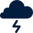

# Icon Lookup Table

| Symbol | Name |  Category | Tags |
|:------:| ---- | --------- | ---- |
|  | Abduction / Kidnapping | Security and Incident | security and incident |
|  | About | UX / UI | ux / ui |
|  | Add | UX / UI | ux / ui |
|  | Add Document | UX / UI | ux / ui |
|  | Advocacy | Activities / Strategy | activities / strategy |
|  | Affected Population | People | people |
|  | Agile | Activities / Strategy | activities / strategy |
|  | Agriculture | Other Sectors | other sectors |
|  | Airport | Logistics | logistics |
|  | Airport Affected | Damage | damage |
|  | Airport Closed | Lockdown | lockdown |
|  | Airport Destroyed | Damage | damage |
|  | Airport Military | Logistics | logistics |
|  | Airport Not Affected | Damage | damage |
|  | Alert | UX / UI | ux / ui |
|  | Analysis | Activities / Strategy | activities / strategy |
|  | Arrest / Detention | Security and Incident | security and incident |
|  | Assault | Security and Incident | security and incident |
|  | Assembly Point | General Infrastructure | general infrastructure |
|  | Assessment | Activities / Strategy | activities / strategy |
|  | Attack | Security and Incident | security and incident |
|  | Bacteria | Health | health |
|  | Blanket | Food and Non-Food Items | food and non-food items |
|  | Blog | UX / UI | ux / ui |
|  | Boat | Logistics | logistics |
|  | Bookmark | UX / UI | ux / ui |
|  | Border Closed | Lockdown | lockdown |
|  | Border Crossing | Physical Barriers | physical barriers |
|  | Borehole | Water, Sanitation and Health | water sanitation and health; wash |
|  | Bottled Water | Food and Non-Food Items | food and non-food items |
|  | Bridge | Logistics | logistics |
|  | Bridge Affected | Damage | damage |
|  | Bridge Closed | Lockdown | lockdown |
|  | Bridge Destroyed | Damage | damage |
|  | Bridge Not Affected | Damage | damage |
|  | Bucket | Food and Non-Food Items | food and non-food items |
|  | Buddhist Temple | General Infrastructure | general infrastructure |
|  | Building | General Infrastructure | general infrastructure |
|  | Building Closed | Lockdown | lockdown |
|  | Building Facility Affected | Damage | damage |
|  | Building Facility Destroyed | Damage | damage |
|  | Building Facility Not Affected | Damage | damage |
|  | Bus | Logistics | logistics |
|  | Calendar | Product Type | product type |
|  | Camp Coordination And Camp Management |  camp-coordination-and-camp-management.svg | Clusters | clusters |
|  | Car | Logistics | logistics |
|  | Carjacking | Security and Incident | security and incident |
|  | Case Management | Health | health |
|  | Cash Transfer | Activities / Strategy | activities / strategy |
|  | Cell Tower | Telecommunications and Technology | telecommunications and technology |
|  | Chart | Product Type | product type |
|  | Chat | UX / UI | ux / ui |
|  | Checkpoint | Physical Barriers | physical barriers |
|  | Child Care / Child Friendly | Other Sectors | other sectors |
|  | Child Combatant | People | people |
|  | Child Protection | Other Sectors | other sectors |
|  | Children | People | people |
|  | Church | General Infrastructure | general infrastructure |
|  | Civil-Military Coordination | Activities / Strategy | activities / strategy |
|  | Clinic | General Infrastructure | general infrastructure |
|  | Clothing | Food and Non-Food Items | food and non-food items |
|  | Cold Wave | Disaster / Hazards and Crises | disaster / hazards and crises |
|  | Communal Latrine | Water, Sanitation and Health | water sanitation and health; wash |
|  | Community Building | General Infrastructure | general infrastructure |
|  | Community Engagement | Activities / Strategy | activities / strategy |
|  | Computer | Telecommunications and Technology | telecommunications and technology |
|  | Confined | Security and Incident | security and incident |
|  | Conflict | Disaster / Hazards and Crises | disaster / hazards and crises |
|  | Coordinated Assessment | Activities / Strategy | activities / strategy |
|  | Coordination | Other Sectors | other sectors |
|  | Copy | UX / UI | ux / ui |
|  | Country | General Infrastructure | general infrastructure |
|  | Covid-19 | Health | health |
|  | Cyclone | Disaster / Hazards and Crises | disaster / hazards and crises |
|  | Damaged / Affected | Damage | damage |
|  | Dangerous Area | Security and Incident | security and incident |
|  | Data | Product Type | product type |
|  | Dead | People | people |
|  | Debris Management | Socioeconomic and Development | socioeconomic and development |
|  | Deployment | Activities / Strategy | activities / strategy |
|  | Destroyed | Damage | damage |
|  | Detergent | Food and Non-Food Items | food and non-food items |
|  | Diplomatic Mission | General Infrastructure | general infrastructure |
|  | Distribution Site | General Infrastructure | general infrastructure |
|  | Doctor | Health | health |
|  | Document | Product Type | product type |
|  | Down | UX / UI | ux / ui |
|  | Download | UX / UI | ux / ui |
|  | Drought | Disaster / Hazards and Crises | disaster / hazards and crises |
|  | Drowned | People | people |
|  | Early Recovery | Clusters | clusters |
|  | Earthmound | Physical Barriers | physical barriers |
|  | Earthquake | Disaster / Hazards and Crises | disaster / hazards and crises |
|  | Education | Clusters | clusters |
|  | Elderly | People | people |
|  | Email | Telecommunications and Technology | telecommunications and technology |
|  | Emergency Telecommunications | Clusters | clusters |
|  | Environment | Other Sectors | other sectors |
|  | Epidemic | Disaster / Hazards and Crises | disaster / hazards and crises |
|  | Exit / Cancel | UX / UI | ux / ui |
|  | Famine | Disaster / Hazards and Crises | disaster / hazards and crises |
|  | Favourite | UX / UI | ux / ui |
|  | Fax | Telecommunications and Technology | telecommunications and technology |
|  | Ferry | Logistics | logistics |
|  | Film | Product Type | product type |
|  | Filter | UX / UI | ux / ui |
|  | Financing | Activities / Strategy | activities / strategy |
|  | Fire | Disaster / Hazards and Crises | disaster / hazards and crises |
|  | Fishery | Other Sectors | other sectors |
|  | Flash Flood | Disaster / Hazards and Crises | disaster / hazards and crises |
|  | Flood | Disaster / Hazards and Crises | disaster / hazards and crises |
|  | Flour | Food and Non-Food Items | food and non-food items |
|  | Folder | UX / UI | ux / ui |
|  | Food | Food and Non-Food Items | food and non-food items |
|  | Food Security | Clusters | clusters |
|  | Food Warehouse | General Infrastructure | general infrastructure |
|  | Forced Entry | Security and Incident | security and incident |
|  | Forced Recruitment | Security and Incident | security and incident |
|  | Fund | Activities / Strategy | activities / strategy |
|  | Gap Analysis | Activities / Strategy | activities / strategy |
|  | Gas Station | Logistics | logistics |
|  | Gender | People | people |
|  | Gender Based Violence | Security and Incident | security and incident |
|  | Go | UX / UI | ux / ui |
|  | Government Office | General Infrastructure | general infrastructure |
|  | Group | UX / UI | ux / ui |
|  | Handwashing | Health | health |
|  | Harassment / Intimidation | Security and Incident | security and incident |
|  | Health | Clusters | clusters |
|  | Health Facility | General Infrastructure | general infrastructure |
|  | Health Facility Affected | Damage | damage |
|  | Health Facility Destroyed | Damage | damage |
|  | Health Facility Not Affected | Damage | damage |
|  | Health Post | General Infrastructure | general infrastructure |
|  | Health Worker | Health | health |
|  | Heatwave | Disaster / Hazards and Crises | disaster / hazards and crises |
|  | Heavy Rain | Disaster / Hazards and Crises | disaster / hazards and crises |
|  | Helicopter | Logistics | logistics |
|  | Helipad | Logistics | logistics |
|  | Help | UX / UI | ux / ui |
|  | Hide | UX / UI | ux / ui |
|  | Hindu Temple | General Infrastructure | general infrastructure |
|  | Hospital | General Infrastructure | general infrastructure |
|  | Hospital Bed | Health | health |
|  | Hotel | General Infrastructure | general infrastructure |
|  | House | General Infrastructure | general infrastructure |
|  | House Affected | Damage | damage |
|  | House Burned | Security and Incident | security and incident |
|  | House Destroyed | Damage | damage |
|  | House Lockdown | Lockdown | lockdown |
|  | House Not Affected | Damage | damage |
|  | Humanitarian Access | Disaster / Hazards and Crises | disaster / hazards and crises |
|  | Humanitarian Programme Cycle | Activities / Strategy | activities / strategy |
|  | Idp / Refugee Camp | Camp | camp |
|  | Indigenous People | People | people |
|  | Infant | People | people |
|  | Infected | Health | health |
|  | Infection Control | Health | health |
|  | Information Management | Activities / Strategy | activities / strategy |
|  | Information Technology | Activities / Strategy | activities / strategy |
|  | Infrastructure | General Infrastructure | general infrastructure |
|  | Injured | People | people |
|  | Innovation | Activities / Strategy | activities / strategy |
|  | Insect Infestation | Disaster / Hazards and Crises | disaster / hazards and crises |
|  | Internally Displaced | Disaster / Hazards and Crises | disaster / hazards and crises |
|  | Internet | Telecommunications and Technology | telecommunications and technology |
|  | Kitchen Set | Food and Non-Food Items | food and non-food items |
|  | Laboratory | Health | health |
|  | Landslide / Mudslide | Disaster / Hazards and Crises | disaster / hazards and crises |
|  | Laptop | Telecommunications and Technology | telecommunications and technology |
|  | Latrine Cabin | Water, Sanitation and Health | water sanitation and health; wash |
|  | Leadership | Activities / Strategy | activities / strategy |
|  | Learning | Activities / Strategy | activities / strategy |
|  | Lifesaving | Health | health |
|  | Link | UX / UI | ux / ui |
|  | Livelihood | Socioeconomic and Development | socioeconomic and development |
|  | Livestock | Socioeconomic and Development | socioeconomic and development |
|  | Location | Product Type | product type |
|  | Location Lockdown | Lockdown | lockdown |
|  | Locust Infestation | Disaster / Hazards and Crises | disaster / hazards and crises |
|  | Logistics | Clusters | clusters |
|  | Map | Product Type | product type |
|  | Market | General Infrastructure | general infrastructure |
|  | Market Closed | Lockdown | lockdown |
|  | Mask | Health | health |
|  | Mattress | Food and Non-Food Items | food and non-food items |
|  | Medical Supply | Food and Non-Food Items | food and non-food items |
|  | Medicine | Food and Non-Food Items | food and non-food items |
|  | Meeting | Activities / Strategy | activities / strategy |
|  | Menu | UX / UI | ux / ui |
|  | Military Gate | Physical Barriers | physical barriers |
|  | Mine | Security and Incident | security and incident |
|  | Missing | People | people |
|  | Mobile Clinic | General Infrastructure | general infrastructure |
|  | Mobile Phone | Telecommunications and Technology | telecommunications and technology |
|  | Monitor | Telecommunications and Technology | telecommunications and technology |
|  | Monitoring | Activities / Strategy | activities / strategy |
|  | More Options | UX / UI | ux / ui |
|  | Mosque | General Infrastructure | general infrastructure |
|  | Mosquito Net | Food and Non-Food Items | food and non-food items |
|  | Multi-Cluster / Multi-Sector | Other Sectors | other sectors |
|  | Murder | Security and Incident | security and incident |
|  | National Army | People | people |
|  | Needs Assessment | Activities / Strategy | activities / strategy |
|  | Next Item | UX / UI | ux / ui |
|  | NGO Office | General Infrastructure | general infrastructure |
|  | Non-Food Items | Food and Non-Food Items | food and non-food items |
|  | Non-Food Items 2 | Food and Non-Food Items | food and non-food items |
|  | Not Affected | Damage | damage |
|  | Not Infected | Health | health |
|  | Notification | UX / UI | ux / ui |
|  | Nutrition | Clusters | clusters |
|  | Observation Tower | Physical Barriers | physical barriers |
|  | Oil | Food and Non-Food Items | food and non-food items |
|  | Oil Facility | General Infrastructure | general infrastructure |
|  | Out Of Platform | UX / UI | ux / ui |
|  | Partnership | Activities / Strategy | activities / strategy |
|  | Pause | UX / UI | ux / ui |
|  | Peacekeeping Force | People | people |
|  | People In Need | People | people |
|  | People Targeted | People | people |
|  | People With Physical Impairments | People | people |
|  | Permanent Camp | Camp | camp |
|  | Person 1 | People | people |
|  | Person 2 | People | people |
|  | Photo | Product Type | product type |
|  | Physical Closure | Physical Barriers | physical barriers |
|  | Plastic Sheeting | Food and Non-Food Items | food and non-food items |
|  | Police Station | General Infrastructure | general infrastructure |
|  | Policy | Activities / Strategy | activities / strategy |
|  | Population Growth | Socioeconomic and Development | socioeconomic and development |
|  | Population Return | Disaster / Hazards and Crises | disaster / hazards and crises |
|  | Port | Logistics | logistics |
|  | Port Affected | Damage | damage |
|  | Port Closed | Lockdown | lockdown |
|  | Port Destroyed | Damage | damage |
|  | Port Not Affected | Damage | damage |
|  | Potable Water | Water, Sanitation and Health | water sanitation and health; wash |
|  | Potable Water Source | Water, Sanitation and Health | water sanitation and health; wash |
|  | Poverty | Disaster / Hazards and Crises | disaster / hazards and crises |
|  | Power / Electricity Affected | Damage | damage |
|  | Power / Electricity Not Affected | Damage | damage |
|  | Power Electricity | General Infrastructure | general infrastructure |
|  | Power Outage | Damage | damage |
|  | Pregnant | People | people |
|  | Preparedness | Activities / Strategy | activities / strategy |
|  | Previous Item | UX / UI | ux / ui |
|  | Print | UX / UI | ux / ui |
|  | Protection | Clusters | clusters |
|  | Public Information | Activities / Strategy | activities / strategy |
|  | Radio | Telecommunications and Technology | telecommunications and technology |
|  | Rebel | People | people |
|  | Reconstruction | Socioeconomic and Development | socioeconomic and development |
|  | Refugee | Disaster / Hazards and Crises | disaster / hazards and crises |
|  | Registration | Camp | camp |
|  | Relief Goods | Food and Non-Food Items | food and non-food items |
|  | Remote Support | Telecommunications and Technology | telecommunications and technology |
|  | Remove | UX / UI | ux / ui |
|  | Remove Document | UX / UI | ux / ui |
|  | Report | Product Type | product type |
|  | Reporting | Activities / Strategy | activities / strategy |
|  | Resilence | Activities / Strategy | activities / strategy |
|  | Respiratory | Health | health |
|  | Response | Activities / Strategy | activities / strategy |
|  | Return | UX / UI | ux / ui |
|  | Rice | Food and Non-Food Items | food and non-food items |
|  | Road | Logistics | logistics |
|  | Road Affected | Damage | damage |
|  | Road Barrier | Physical Barriers | physical barriers |
|  | Road Closed | Lockdown | lockdown |
|  | Road Destroyed | Damage | damage |
|  | Road Not Affected | Damage | damage |
|  | Roadblock | Physical Barriers | physical barriers |
|  | Robbery | Security and Incident | security and incident |
|  | Rule Of Law And Justice | Other Sectors | other sectors |
|  | Rural | Socioeconomic and Development | socioeconomic and development |
|  | Rural Exodus | Socioeconomic and Development | socioeconomic and development |
|  | Safety And Security | Other Sectors | other sectors |
|  | Salt | Food and Non-Food Items | food and non-food items |
|  | Sanitation | Water, Sanitation and Health | water sanitation and health; wash |
|  | Sanitizer | Health | health |
|  | Satellite Dish | Telecommunications and Technology | telecommunications and technology |
|  | Save | UX / UI | ux / ui |
|  | Scale Down Operation | Activities / Strategy | activities / strategy |
|  | Scale Up Operation | Activities / Strategy | activities / strategy |
|  | School | General Infrastructure | general infrastructure |
|  | School Affected | Damage | damage |
|  | School Closed | Lockdown | lockdown |
|  | School Destroyed | Damage | damage |
|  | School Not Affected | Damage | damage |
|  | Search | UX / UI | ux / ui |
|  | Search And Rescue | Activities / Strategy | activities / strategy |
|  | See | UX / UI | ux / ui |
|  | Selected | UX / UI | ux / ui |
|  | Services And Tools | Activities / Strategy | activities / strategy |
|  | Settings | UX / UI | ux / ui |
|  | Sexual And Reproductive Health | Activities / Strategy | activities / strategy |
|  | Sexual Violence | Security and Incident | security and incident |
|  | Share | UX / UI | ux / ui |
|  | Shelter | Clusters | clusters |
|  | Ship | Logistics | logistics |
|  | Shower | Water, Sanitation and Health | water sanitation and health; wash |
|  | Smartphone | Telecommunications and Technology | telecommunications and technology |
|  | Snow Avalanche | Disaster / Hazards and Crises | disaster / hazards and crises |
|  | Snowfall | Disaster / Hazards and Crises | disaster / hazards and crises |
|  | Soap | Food and Non-Food Items | food and non-food items |
|  | Social Distancing | Health | health |
|  | Solid Waste | Water, Sanitation and Health | water sanitation and health; wash |
|  | Spontaneous Site | Camp | camp |
|  | Spring Water | Water, Sanitation and Health | water sanitation and health; wash |
|  | Staff Management | Activities / Strategy | activities / strategy |
|  | Stop | UX / UI | ux / ui |
|  | Storm | Disaster / Hazards and Crises | disaster / hazards and crises |
|  | Storm Surge | Disaster / Hazards and Crises | disaster / hazards and crises |
|  | Stove | Food and Non-Food Items | food and non-food items |
|  | Submersible Pump | Water, Sanitation and Health | water sanitation and health; wash |
|  | Sugar | Food and Non-Food Items | food and non-food items |
|  | Table | Product Type | product type |
|  | Tarpaulin | Food and Non-Food Items | food and non-food items |
|  | Technological Disaster | Disaster / Hazards and Crises | disaster / hazards and crises |
|  | Temporary Camp | Camp | camp |
|  | Tent | Food and Non-Food Items | food and non-food items |
|  | Testing | Health | health |
|  | Toilet | Water, Sanitation and Health | water sanitation and health; wash |
|  | Top Ranking | Activities / Strategy | activities / strategy |
|  | Tornado | Disaster / Hazards and Crises | disaster / hazards and crises |
|  | Trade And Market | Socioeconomic and Development | socioeconomic and development |
|  | Train | Logistics | logistics |
|  | Training | Activities / Strategy | activities / strategy |
|  | Transition Site | Camp | camp |
|  | Trending | UX / UI | ux / ui |
|  | Truck | Logistics | logistics |
|  | Tsunami | Disaster / Hazards and Crises | disaster / hazards and crises |
|  | Tunnel | Logistics | logistics |
|  | UN Compound / Office | General Infrastructure | general infrastructure |
|  | UN Vehicle | Logistics | logistics |
|  | University | General Infrastructure | general infrastructure |
|  | Up | UX / UI | ux / ui |
|  | Upload | UX / UI | ux / ui |
|  | Urban | Socioeconomic and Development | socioeconomic and development |
|  | Urban / Rural | Socioeconomic and Development | socioeconomic and development |
|  | User | UX / UI | ux / ui |
|  | Users | UX / UI | ux / ui |
|  | Vaccine | Food and Non-Food Items | food and non-food items |
|  | Ventilator | Health | health |
|  | Video | Product Type | product type |
|  | Violent Wind | Disaster / Hazards and Crises | disaster / hazards and crises |
|  | Virus | Health | health |
|  | Volcano | Disaster / Hazards and Crises | disaster / hazards and crises |
|  | Walkie Talkie | Telecommunications and Technology | telecommunications and technology |
|  | Warning / Error | UX / UI | ux / ui |
|  | Water Source | Water, Sanitation and Health | water sanitation and health; wash |
|  | Water Trucking | Water, Sanitation and Health | water sanitation and health; wash |
|  | Water, Sanitation And Hygiene | Clusters | clusters |
|  | Work From Home | Telecommunications and Technology | telecommunications and technology |
|  | Worm Infestation | Disaster / Hazards and Crises | disaster / hazards and crises |
|  | Zip / Compressed | UX / UI | ux / ui |
